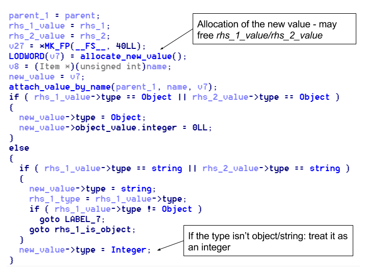

Assignment Writeup
==================

A few weeks ago I’ve decided to improve my pwning skills and try some
exploitation challenges. A friend pointed me towards this cool challenge and
I’ve decided to share my solution.

In this CTF the goal was to exploit some server which ran a simple app called
*“assignment”*.

**Functionality:**
------------------

-   Assigning value to variables.

-   Adding variables/values and assigning the result to variable.

**Internal representation:**
----------------------------

Values could be of 3 types:

-   1 - String

-   0 - Int (64 bit)

-   2 - Object.

And were represented by a simple struct:

| Type    |
|---------|
| Value   |
| Is_used |

A variable is represented by the following struct:

| Name (char)             |
|-------------------------|
| Pointer to value struct |
| Pointer to next         |

An object is simply a pointer to list of variables.

A string:

| Size                     |
|--------------------------|
| Pointer to string buffer |

In addition the program manages the value allocations with a garbage collector.
Which run every 20 allocations of items and frees all the items which are
predecessor of the root object - which means all the items which doesn't have a
name or that does have a name but was overridden, and their immediate sons
(string or the list of variables for variables).

**Basic vulnerability**
-----------------------

When adding 2 values, the first thing been done is allocations of the new value,
but the values that we add can be free by the garbage collector in this
allocation but still used in the addition, yielding UAF vulnerability.

**Leaking memory**
------------------

First thing first we will leak an address in the heap. We will notice that the
first field in the value struct is the type, and that if the type is unknown the
“add” function will **regard it as an integer**.

We Will exploit it in the following way:

1.  add a string and an 0 value integer such that when the add function will
    allocate the value where the sum will be, the garbage collector will run.

2.  The the 2 values we add will be freed, return to their fastbin and their
    first field will be overridden by the free function.

3.  The add function will add the to values inside those freed items as if they
    were integers even though one of them is a pointer to the string.

4.  Now when we will print the variable we added the values to, we will get the
    pointer to the string.

**Arbitrary Read and Libc Address**
-----------------------------------

Now we have an address in the heap, so we can know relative addresses in the
heap but we would like to get an address in the libc section in order to get the
value of Libc_base and be able to write to the malloc hook and get code
execution. We would like to get a pointer in constant offset in the heap that
will point to the main arena - we will do that by simply allocating big enough
string and then freeing it using the garbage collector, now it will return to
the unsorted list in the heap and will point to the main arena which is in the
libc.

In order to read this address we will use a variation of the vulnerability again
but this time it will be a bit more complicated:

We will notice that the “add” function has a recursion when adding an object -
it adds all the elements in the object to the other value (if it isn’t also a
value). But when returning from the recursion the function checks again the type
of the parent object (the one that we already checked and was an object) and if
it is not an object it adds it as its current type - WTF?.

So we will be able to create an object that points to location of our choice by
adding an object to an integer and putting the result in the same object, if
exactly when allocating the new son of the object the garbage collector will
run, than when returning from the recursion the parent object that we add will
be freed and the function will treat it as an integer and put the result of it’s
value (the pointer to it’s old list of variables) plus the integer we add (which
we control), but the type will still be an object (since the type is determined
at the function start). So we will be able to put there whichever value that we
want.

**And in more details:**

1.  We will create an object (*a.s* = “aaaaaaaaa”)

2.  We will create an Integer (*z* = SOME_OFFSET)

3.  We will add *z* and *a* (*a=a+z*) in a way such that when the recursion will
    allocate the new *a.a* the garbage collector will run.

4.  The GC will free the old *a* (because it has already connected the new *a*
    to the root object).

5.  The recursion will return and check if *a* is an object, but a was freed so
    the type field was overridden by the free with a pointer.

6.  The “add” function will think that it adds 2 integers and will put the value
    of the old *a* (a pointer) plus *z* into the value field of the new *a,* but
    the field value of the new *a* will remain object type.

7.  We have an object that point to a location of our choice and we basically
    won.

8.  We create a string such that *a* will point to offset 16 of the raw string
    (will be explained). Now if we will put a string such that in location 16
    there is a value, we can create an item to our choice, so we will put there
    a string value, that will point to a location of our choice.

9.  We will do the same trick and create a string of our choice and make this
    string point to the location where we know we have a pointer to the libc.

10. We will print *a* and now we have a pointer to the libc.

**Arbitrary Write**
-------------------

In order to get arbitrary write we will use the fastbin attack that was used in
the babyheap challenge. We will want to free a chunk and then be able to
overwrite the “next” field in the chunk. To do this we will notice that when we
will free *a,* we will also free the variables that *a* points to which is the
middle of our controlled string. We will exploit it in the following way:

1.  Put a fake chunk header of size 0x70 before the value we have created (That
    is why we pointed to offset 16 and not to the start of the string).

2.  Free *a.* (and free our fake chunk)

3.  Rewrite the string to point to the address we want in the libc (malloc
    hook).

4.  Allocate chunks from the correct fastbin until allocating the chunk we’ve
    freed - the next allocation of size 0x70 will use the “next” field of our
    fake chunk a.k.a malloc hook.

5.  Allocating a string of size 0x70 that will contain the address we will want
    to jump to - could be ROP chain but in our case a one gadget to “exec sh”.

6.  Allocating another string and jumping to the address.

**Some challenges:**

1.  Malloc checks the size of the allocated object so I found an offset before
    malloc hook such that it will contain 0x7 and pass the check (it checks only
    the relevant bits of the fastbin so it could be 0x71).

2.  The one gadget needed some register to be 0 and it contained the size of the
    allocation, so i’ve allocated a string of size 0.

Resources
---------

-   [The challenge](assignment)

-   [Full solution](solver.py)

-   [Ida file](assignment.i64)
